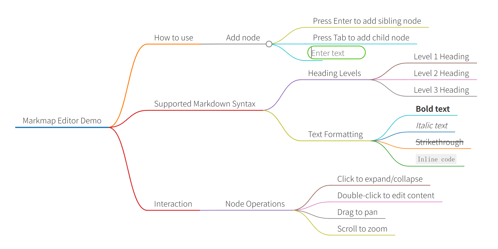

## 从这里开始

markmap++ 完全运行在浏览器中。第一次使用可以直接打开应用并修改欢迎示例；示例会在下次打开时恢复，因此需要保留的内容应导出为 Markdown，或者绑定 GitHub 仓库进行持久保存。

<section class="home-app-spotlight" aria-labelledby="home-app-title">
  

    

      
      

        Web + Desktop
        <h2 id="home-app-title">把笔记变成可以继续工作的导图</h2>
      

    

    
浏览器版适合随时打开，桌面 App 适合直接读写本地 Markdown 和 Git 工作区。两者共享编辑器、导图、Agent 与 GitHub 同步能力。

    

      <a class="home-app-primary" href="./app/">了解 App 与下载方式</a>
      <a class="home-app-secondary" href="https://jeoitim.github.io/markmap-pp/">立即打开 Web 版</a>
    

  

  

    
  

</section>

<section class="home-workflow" aria-labelledby="home-workflow-title">
  

    One source, more momentum
    <h2 id="home-workflow-title">一份 Markdown，三种继续工作的方式</h2>
    
从记录到整理，再到跨设备同步，markmap++ 让内容始终留在你能审阅和带走的源文件里。

  

  

    <article class="home-workflow-card">
      01
      <h3>写下来，马上看见结构</h3>
      
左侧编辑 Markdown，右侧实时展开思维导图；节点、画布和主题都能继续调整。

      Markdown → Mind map
    </article>
    <article class="home-workflow-card">
      02
      <h3>让 Agent 帮你继续整理</h3>
      
结合当前笔记和上下文提问，在 Edit 模式中先看方案、再审核每一处修改。

      Ask → Review → Apply
    </article>
    <article class="home-workflow-card">
      03
      <h3>带着自己的仓库走</h3>
      
连接 GitHub 笔记仓库，在浏览器、桌面 App 和移动设备之间继续你的工作。

      GitHub sync
    </article>
  

</section>
